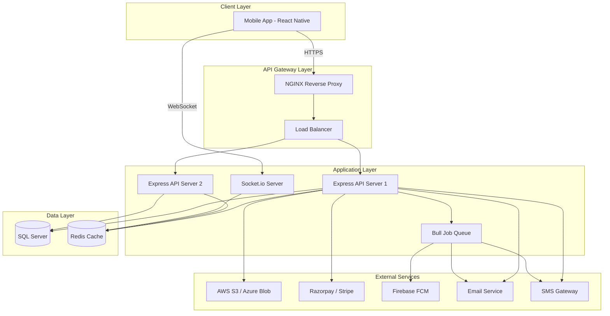
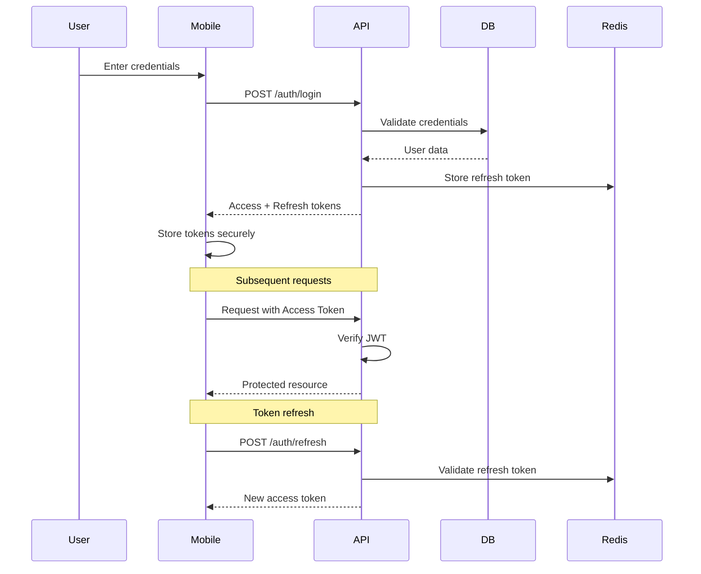
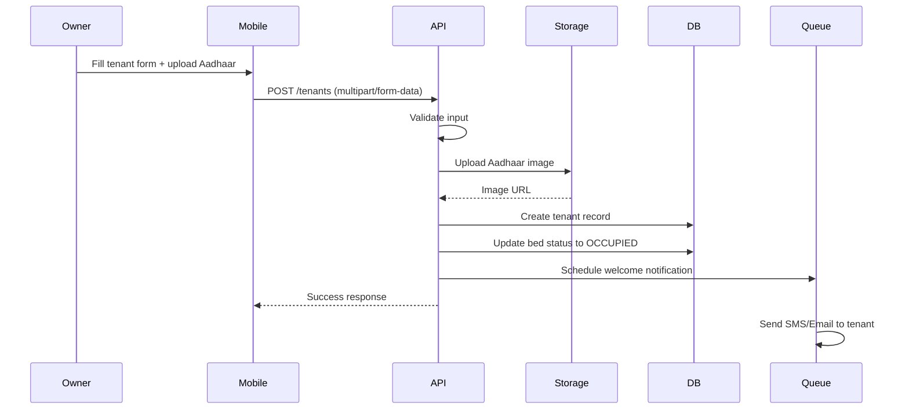
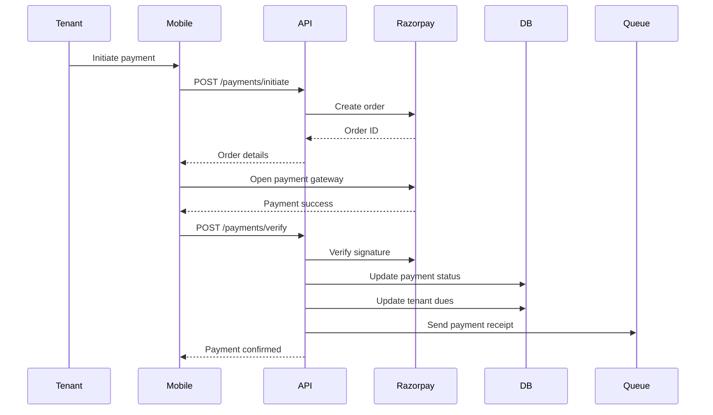
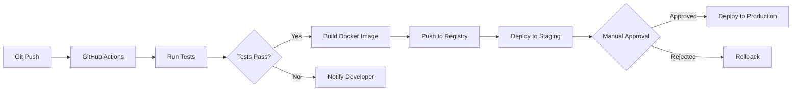

# Hostel Management Application - System Architecture

## 1. Overview

A production-ready, multi-tenant hostel management system supporting three distinct user roles: **Hostel Owners**, **Tenants**, and **Guests**. The application enables comprehensive hostel operations including room management, tenant lifecycle, payment tracking, food services, and short-stay bookings.

---

## 2. Technology Stack

### **Mobile Application**
- **Framework**: React Native (iOS & Android)
- **State Management**: Redux Toolkit / Zustand
- **Navigation**: React Navigation v6
- **UI Components**: React Native Paper / Native Base
- **Forms**: React Hook Form + Yup validation
- **HTTP Client**: Axios with interceptors
- **Real-time**: Socket.io-client
- **Payment SDK**: Razorpay React Native SDK
- **Maps**: React Native Maps
- **Push Notifications**: Firebase Cloud Messaging (FCM)
- **Image Handling**: React Native Image Picker
- **Storage**: AsyncStorage / MMKV

### **Backend API**
- **Runtime**: Node.js v18+
- **Framework**: Express.js
- **Authentication**: JWT (Access + Refresh tokens)
- **Validation**: Joi / Express-validator
- **ORM**: Sequelize (for SQL Server)
- **File Upload**: Multer
- **Storage**: AWS S3 / Azure Blob Storage
- **Payment Gateway**: Razorpay / Stripe
- **Email**: Nodemailer / SendGrid
- **SMS**: Twilio / AWS SNS
- **Real-time**: Socket.io
- **Job Queue**: Bull (Redis-based)
- **Logging**: Winston + Morgan
- **Security**: Helmet, express-rate-limit, cors

### **Database**
- **Primary DB**: Microsoft SQL Server 2019+
- **Caching**: Redis (sessions, rate limiting, job queues)
- **Search**: (Optional) Elasticsearch for hostel discovery

### **Infrastructure**
- **Hosting**: AWS EC2 / Azure VM
- **Storage**: AWS S3 / Azure Blob Storage
- **CDN**: CloudFront / Azure CDN
- **CI/CD**: GitHub Actions / Azure DevOps
- **Monitoring**: AWS CloudWatch / Azure Monitor
- **Container**: Docker (optional)

---

## 3. System Architecture Diagram



---

## 4. High-Level Architecture Components

### **4.1 Mobile Application Architecture**

```
src/
├── api/                    # API service layer
│   ├── auth.service.js
│   ├── hostel.service.js
│   ├── tenant.service.js
│   └── payment.service.js
├── components/             # Reusable UI components
│   ├── common/
│   ├── hostel/
│   └── tenant/
├── screens/                # Screen components
│   ├── auth/
│   ├── owner/
│   ├── tenant/
│   └── guest/
├── navigation/             # Navigation configuration
│   ├── AuthNavigator.js
│   ├── OwnerNavigator.js
│   ├── TenantNavigator.js
│   └── GuestNavigator.js
├── store/                  # State management
│   ├── slices/
│   └── store.js
├── utils/                  # Utilities & helpers
│   ├── validators.js
│   ├── constants.js
│   └── helpers.js
└── config/                 # App configuration
    └── config.js
```

### **4.2 Backend API Architecture**

```
src/
├── config/                 # Configuration files
│   ├── database.js
│   ├── redis.js
│   └── aws.js
├── models/                 # Sequelize models
│   ├── User.js
│   ├── Hostel.js
│   ├── Room.js
│   └── Booking.js
├── controllers/            # Request handlers
│   ├── auth.controller.js
│   ├── hostel.controller.js
│   └── payment.controller.js
├── services/               # Business logic
│   ├── auth.service.js
│   ├── payment.service.js
│   └── notification.service.js
├── middleware/             # Express middleware
│   ├── auth.middleware.js
│   ├── validation.middleware.js
│   └── error.middleware.js
├── routes/                 # API routes
│   ├── auth.routes.js
│   ├── hostel.routes.js
│   └── tenant.routes.js
├── utils/                  # Utilities
│   ├── jwt.util.js
│   ├── upload.util.js
│   └── email.util.js
├── jobs/                   # Background jobs
│   ├── payment-reminder.job.js
│   └── notification.job.js
└── app.js                  # Express app entry
```

---

## 5. Security Architecture

### **5.1 Authentication Flow**



### **5.2 Role-Based Access Control (RBAC)**

| Role | Permissions |
|------|-------------|
| **Hostel Owner** | Full CRUD on owned hostels, rooms, tenants, payments, food menu, announcements |
| **Tenant** | Read-only access to assigned bed, dues, food menu, announcements |
| **Guest** | Search hostels, create bookings, view booking history |
| **Super Admin** | System configuration, user management, analytics across all hostels |

### **5.3 Security Measures**

- **JWT Tokens**: Short-lived access tokens (15 min), long-lived refresh tokens (7 days)
- **Password Hashing**: bcrypt with salt rounds = 12
- **Rate Limiting**: 100 requests/15 min per IP
- **Input Validation**: Joi schemas on all endpoints
- **SQL Injection Prevention**: Parameterized queries via Sequelize
- **XSS Protection**: Helmet.js middleware
- **CORS**: Whitelist mobile app origins
- **File Upload**: Validate file types, size limits, scan for malware
- **Sensitive Data**: Encrypt Aadhaar images at rest (AES-256)
- **HTTPS Only**: TLS 1.3 for all communications
- **API Versioning**: `/api/v1/` prefix

---

## 6. Data Flow Architecture

### **6.1 Tenant Onboarding Flow**



### **6.2 Payment Processing Flow**



---

## 7. Scalability Considerations

### **7.1 Horizontal Scaling**
- Stateless API servers behind load balancer
- Session data in Redis (shared across instances)
- Database connection pooling (min: 5, max: 20 per instance)

### **7.2 Caching Strategy**
- **Redis Cache**: Hostel listings, room availability, food menus (TTL: 5 min)
- **CDN**: Static assets, Aadhaar images
- **API Response Caching**: GET endpoints with ETag headers

### **7.3 Database Optimization**
- Indexed columns: user_id, hostel_id, room_id, bed_id, booking_date
- Partitioning: Payment transactions by year
- Read replicas for analytics queries
- Archival: Move old bookings (>2 years) to archive tables

### **7.4 Background Jobs**
- Payment reminders (daily at 9 AM)
- Booking confirmations (immediate)
- Analytics aggregation (nightly)
- Notification batching (every 5 min)

---

## 8. Monitoring & Observability

### **8.1 Logging**
- **Application Logs**: Winston (JSON format)
- **Access Logs**: Morgan (combined format)
- **Error Tracking**: Sentry / Rollbar
- **Log Aggregation**: CloudWatch / ELK Stack

### **8.2 Metrics**
- API response times (p50, p95, p99)
- Error rates by endpoint
- Database query performance
- Cache hit/miss ratios
- Payment success rates

### **8.3 Alerts**
- API error rate > 5%
- Database connection pool exhaustion
- Payment gateway failures
- Disk space > 80%
- High memory usage

---

## 9. Deployment Architecture

### **9.1 Environment Strategy**

| Environment | Purpose | Database | Redis |
|-------------|---------|----------|-------|
| **Development** | Local development | Local SQL Server | Local Redis |
| **Staging** | Pre-production testing | Staging DB | Staging Redis |
| **Production** | Live application | Production DB (HA) | Production Redis (Cluster) |

### **9.2 CI/CD Pipeline**



---

## 10. Disaster Recovery & Backup

### **10.1 Backup Strategy**
- **Database**: Daily full backup + hourly incremental
- **File Storage**: S3 versioning enabled
- **Retention**: 30 days for daily, 7 days for hourly
- **Backup Location**: Different AWS region / Azure geo-redundant

### **10.2 Recovery Plan**
- **RTO (Recovery Time Objective)**: 4 hours
- **RPO (Recovery Point Objective)**: 1 hour
- **Failover**: Automated database failover to standby replica
- **Rollback**: Blue-green deployment for zero-downtime rollbacks

---

## 11. Performance Targets

| Metric | Target |
|--------|--------|
| API Response Time (p95) | < 500ms |
| Database Query Time (p95) | < 200ms |
| Mobile App Launch Time | < 3s |
| Payment Processing Time | < 10s |
| Concurrent Users | 10,000+ |
| Uptime SLA | 99.9% |

---

## 12. Cost Optimization

- **Auto-scaling**: Scale down during off-peak hours
- **Reserved Instances**: For baseline capacity
- **S3 Lifecycle**: Move old Aadhaar images to Glacier after 1 year
- **CDN**: Reduce origin requests by 80%
- **Database**: Right-size instance based on metrics

---

This architecture provides a solid foundation for a production-ready, scalable hostel management system. Next, I'll detail the database schema design.
