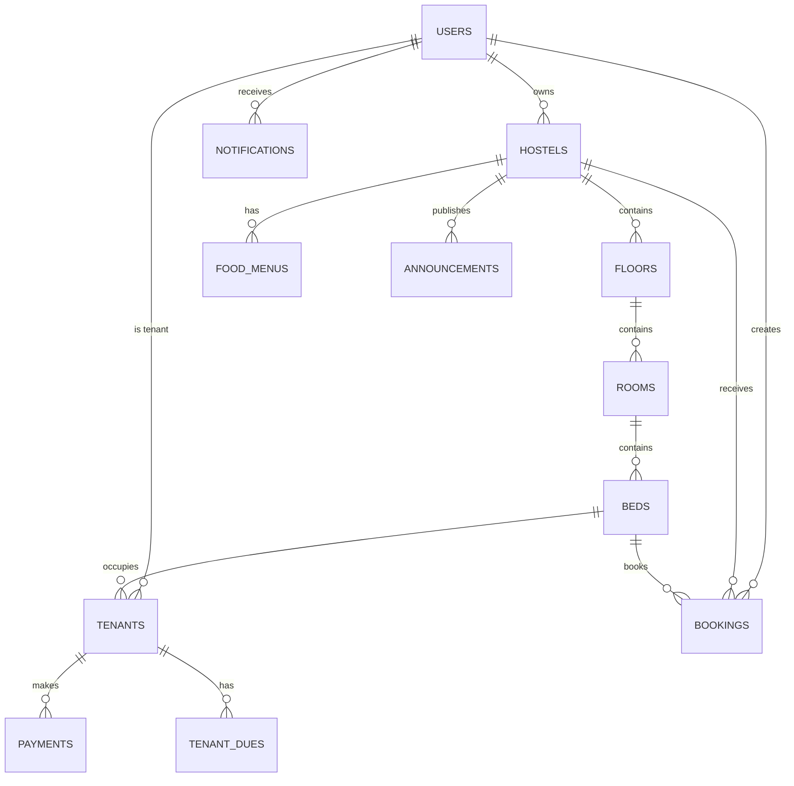

# Database Schema Design - SQL Server

## 1. Overview

This document defines the complete database schema for the Hostel Management Application using Microsoft SQL Server. The schema supports multi-tenancy, role-based access, payment tracking, food management, and guest bookings.

---

## 2. Database Design Principles

- **Normalization**: 3NF to minimize redundancy
- **Soft Deletes**: Use `is_deleted` flag instead of hard deletes
- **Audit Trails**: `created_at`, `updated_at` on all tables
- **UUID Support**: Use `UNIQUEIDENTIFIER` for public-facing IDs
- **Indexing**: Strategic indexes on foreign keys and query columns
- **Constraints**: Enforce data integrity at database level

---

## 3. Entity Relationship Diagram



---

## 4. Table Definitions

### **4.1 Users Table**

Stores all users (Owners, Tenants, Guests, Admins).

```sql
CREATE TABLE users (
    id INT IDENTITY(1,1) PRIMARY KEY,
    uuid UNIQUEIDENTIFIER DEFAULT NEWID() UNIQUE NOT NULL,
    
    -- Authentication
    email VARCHAR(255) UNIQUE NOT NULL,
    phone VARCHAR(20) UNIQUE NOT NULL,
    password_hash VARCHAR(255) NOT NULL,
    
    -- Profile
    full_name VARCHAR(255) NOT NULL,
    role VARCHAR(20) NOT NULL CHECK (role IN ('OWNER', 'TENANT', 'GUEST', 'ADMIN')),
    profile_image_url VARCHAR(500),
    
    -- Verification
    email_verified BIT DEFAULT 0,
    phone_verified BIT DEFAULT 0,
    
    -- Status
    is_active BIT DEFAULT 1,
    is_deleted BIT DEFAULT 0,
    
    -- Audit
    created_at DATETIME2 DEFAULT GETDATE(),
    updated_at DATETIME2 DEFAULT GETDATE(),
    last_login_at DATETIME2,
    
    -- Indexes
    INDEX idx_email (email),
    INDEX idx_phone (phone),
    INDEX idx_role (role),
    INDEX idx_uuid (uuid)
);
```

**Sample Data:**
```sql
INSERT INTO users (email, phone, password_hash, full_name, role, email_verified, phone_verified)
VALUES 
('owner@hostel.com', '+919876543210', '$2b$12$...', 'Rajesh Kumar', 'OWNER', 1, 1),
('tenant@example.com', '+919876543211', '$2b$12$...', 'Amit Sharma', 'TENANT', 1, 1),
('guest@example.com', '+919876543212', '$2b$12$...', 'Priya Singh', 'GUEST', 1, 0);
```

---

### **4.2 Hostels Table**

Stores hostel properties owned by users.

```sql
CREATE TABLE hostels (
    id INT IDENTITY(1,1) PRIMARY KEY,
    uuid UNIQUEIDENTIFIER DEFAULT NEWID() UNIQUE NOT NULL,
    
    -- Ownership
    owner_id INT NOT NULL FOREIGN KEY REFERENCES users(id),
    
    -- Basic Info
    name VARCHAR(255) NOT NULL,
    description TEXT,
    hostel_type VARCHAR(20) CHECK (hostel_type IN ('BOYS', 'GIRLS', 'CO_ED')),
    
    -- Location
    address_line1 VARCHAR(255) NOT NULL,
    address_line2 VARCHAR(255),
    city VARCHAR(100) NOT NULL,
    state VARCHAR(100) NOT NULL,
    pincode VARCHAR(10) NOT NULL,
    latitude DECIMAL(10, 8),
    longitude DECIMAL(11, 8),
    
    -- Contact
    contact_phone VARCHAR(20),
    contact_email VARCHAR(255),
    
    -- Amenities (JSON)
    amenities NVARCHAR(MAX), -- JSON array: ["WiFi", "Laundry", "AC", "Parking"]
    
    -- Images (JSON)
    images NVARCHAR(MAX), -- JSON array of image URLs
    
    -- Pricing
    monthly_rent_min DECIMAL(10, 2),
    monthly_rent_max DECIMAL(10, 2),
    daily_rate DECIMAL(10, 2), -- For guest bookings
    
    -- Settings
    food_included BIT DEFAULT 0,
    allow_guest_bookings BIT DEFAULT 1,
    
    -- Status
    is_active BIT DEFAULT 1,
    is_deleted BIT DEFAULT 0,
    
    -- Audit
    created_at DATETIME2 DEFAULT GETDATE(),
    updated_at DATETIME2 DEFAULT GETDATE(),
    
    -- Indexes
    INDEX idx_owner (owner_id),
    INDEX idx_city (city),
    INDEX idx_location (latitude, longitude),
    INDEX idx_uuid (uuid)
);
```

**Sample Data:**
```sql
INSERT INTO hostels (owner_id, name, description, hostel_type, address_line1, city, state, pincode, 
                     latitude, longitude, contact_phone, amenities, monthly_rent_min, monthly_rent_max, daily_rate, food_included)
VALUES 
(1, 'Green Valley Boys Hostel', 'Comfortable hostel near IT park', 'BOYS', 
 '123 MG Road', 'Bangalore', 'Karnataka', '560001', 
 12.9716, 77.5946, '+919876543210', 
 '["WiFi", "Laundry", "AC", "Parking", "Security"]', 
 5000.00, 12000.00, 500.00, 1);
```

---

### **4.3 Floors Table**

Stores floor information within hostels.

```sql
CREATE TABLE floors (
    id INT IDENTITY(1,1) PRIMARY KEY,
    uuid UNIQUEIDENTIFIER DEFAULT NEWID() UNIQUE NOT NULL,
    
    -- Hostel Reference
    hostel_id INT NOT NULL FOREIGN KEY REFERENCES hostels(id),
    
    -- Floor Info
    floor_number INT NOT NULL, -- 0 for ground, 1 for first, etc.
    floor_name VARCHAR(100), -- Optional: "Ground Floor", "First Floor"
    
    -- Status
    is_active BIT DEFAULT 1,
    is_deleted BIT DEFAULT 0,
    
    -- Audit
    created_at DATETIME2 DEFAULT GETDATE(),
    updated_at DATETIME2 DEFAULT GETDATE(),
    
    -- Constraints
    CONSTRAINT uq_hostel_floor UNIQUE (hostel_id, floor_number),
    
    -- Indexes
    INDEX idx_hostel (hostel_id)
);
```

---

### **4.4 Rooms Table**

Stores room information within floors.

```sql
CREATE TABLE rooms (
    id INT IDENTITY(1,1) PRIMARY KEY,
    uuid UNIQUEIDENTIFIER DEFAULT NEWID() UNIQUE NOT NULL,
    
    -- Floor Reference
    floor_id INT NOT NULL FOREIGN KEY REFERENCES floors(id),
    hostel_id INT NOT NULL FOREIGN KEY REFERENCES hostels(id),
    
    -- Room Info
    room_number VARCHAR(50) NOT NULL,
    room_name VARCHAR(100),
    room_type VARCHAR(20) CHECK (room_type IN ('SINGLE', 'DOUBLE', 'TRIPLE', 'QUAD', 'DORMITORY')),
    
    -- Capacity
    total_beds INT NOT NULL CHECK (total_beds > 0),
    
    -- Amenities
    has_ac BIT DEFAULT 0,
    has_attached_bathroom BIT DEFAULT 0,
    amenities NVARCHAR(MAX), -- JSON array
    
    -- Pricing
    rent_per_bed DECIMAL(10, 2) NOT NULL,
    
    -- Status
    is_active BIT DEFAULT 1,
    is_deleted BIT DEFAULT 0,
    
    -- Audit
    created_at DATETIME2 DEFAULT GETDATE(),
    updated_at DATETIME2 DEFAULT GETDATE(),
    
    -- Constraints
    CONSTRAINT uq_hostel_room UNIQUE (hostel_id, room_number),
    
    -- Indexes
    INDEX idx_floor (floor_id),
    INDEX idx_hostel (hostel_id)
);
```

---

### **4.5 Beds Table**

Stores individual bed information within rooms.

```sql
CREATE TABLE beds (
    id INT IDENTITY(1,1) PRIMARY KEY,
    uuid UNIQUEIDENTIFIER DEFAULT NEWID() UNIQUE NOT NULL,
    
    -- Room Reference
    room_id INT NOT NULL FOREIGN KEY REFERENCES rooms(id),
    hostel_id INT NOT NULL FOREIGN KEY REFERENCES hostels(id),
    
    -- Bed Info
    bed_number VARCHAR(50) NOT NULL,
    bed_label VARCHAR(100), -- e.g., "Bed A", "Lower Bunk"
    
    -- Status
    status VARCHAR(20) DEFAULT 'AVAILABLE' CHECK (status IN ('AVAILABLE', 'OCCUPIED', 'RESERVED', 'MAINTENANCE')),
    
    -- Pricing (can override room pricing)
    custom_rent DECIMAL(10, 2), -- NULL means use room's rent_per_bed
    
    -- Active Status
    is_active BIT DEFAULT 1,
    is_deleted BIT DEFAULT 0,
    
    -- Audit
    created_at DATETIME2 DEFAULT GETDATE(),
    updated_at DATETIME2 DEFAULT GETDATE(),
    
    -- Constraints
    CONSTRAINT uq_room_bed UNIQUE (room_id, bed_number),
    
    -- Indexes
    INDEX idx_room (room_id),
    INDEX idx_hostel (hostel_id),
    INDEX idx_status (status)
);
```

---

### **4.6 Tenants Table**

Stores tenant information and their bed assignments.

```sql
CREATE TABLE tenants (
    id INT IDENTITY(1,1) PRIMARY KEY,
    uuid UNIQUEIDENTIFIER DEFAULT NEWID() UNIQUE NOT NULL,
    
    -- User Reference
    user_id INT FOREIGN KEY REFERENCES users(id), -- NULL if tenant doesn't have app account
    
    -- Hostel & Bed Assignment
    hostel_id INT NOT NULL FOREIGN KEY REFERENCES hostels(id),
    bed_id INT NOT NULL FOREIGN KEY REFERENCES beds(id),
    
    -- Personal Info (if user_id is NULL)
    full_name VARCHAR(255) NOT NULL,
    email VARCHAR(255),
    phone VARCHAR(20) NOT NULL,
    
    -- KYC Documents
    aadhaar_number VARCHAR(12) UNIQUE,
    aadhaar_image_url VARCHAR(500), -- Encrypted storage URL
    photo_url VARCHAR(500),
    
    -- Emergency Contact
    emergency_contact_name VARCHAR(255),
    emergency_contact_phone VARCHAR(20),
    emergency_contact_relation VARCHAR(50),
    
    -- Occupancy Details
    joining_date DATE NOT NULL,
    vacating_date DATE,
    notice_period_days INT DEFAULT 30,
    
    -- Rent Details
    monthly_rent DECIMAL(10, 2) NOT NULL,
    security_deposit DECIMAL(10, 2) DEFAULT 0,
    advance_paid DECIMAL(10, 2) DEFAULT 0,
    
    -- Payment Cycle
    rent_due_day INT DEFAULT 1 CHECK (rent_due_day BETWEEN 1 AND 31), -- Day of month
    
    -- Status
    status VARCHAR(20) DEFAULT 'ACTIVE' CHECK (status IN ('ACTIVE', 'NOTICE_PERIOD', 'VACATED', 'SUSPENDED')),
    is_deleted BIT DEFAULT 0,
    
    -- Audit
    created_at DATETIME2 DEFAULT GETDATE(),
    updated_at DATETIME2 DEFAULT GETDATE(),
    
    -- Indexes
    INDEX idx_user (user_id),
    INDEX idx_hostel (hostel_id),
    INDEX idx_bed (bed_id),
    INDEX idx_status (status),
    INDEX idx_phone (phone)
);
```

**Sample Data:**
```sql
INSERT INTO tenants (user_id, hostel_id, bed_id, full_name, email, phone, aadhaar_number, 
                     joining_date, monthly_rent, security_deposit, status)
VALUES 
(2, 1, 1, 'Amit Sharma', 'tenant@example.com', '+919876543211', '123456789012', 
 '2026-01-01', 8000.00, 16000.00, 'ACTIVE');
```

---

### **4.7 Tenant Dues Table**

Tracks monthly rent dues for each tenant.

```sql
CREATE TABLE tenant_dues (
    id INT IDENTITY(1,1) PRIMARY KEY,
    uuid UNIQUEIDENTIFIER DEFAULT NEWID() UNIQUE NOT NULL,
    
    -- Tenant Reference
    tenant_id INT NOT NULL FOREIGN KEY REFERENCES tenants(id),
    hostel_id INT NOT NULL FOREIGN KEY REFERENCES hostels(id),
    
    -- Due Period
    due_month INT NOT NULL CHECK (due_month BETWEEN 1 AND 12),
    due_year INT NOT NULL,
    due_date DATE NOT NULL,
    
    -- Amounts
    rent_amount DECIMAL(10, 2) NOT NULL,
    food_charges DECIMAL(10, 2) DEFAULT 0,
    electricity_charges DECIMAL(10, 2) DEFAULT 0,
    other_charges DECIMAL(10, 2) DEFAULT 0,
    late_fee DECIMAL(10, 2) DEFAULT 0,
    total_amount DECIMAL(10, 2) NOT NULL,
    
    -- Payment Status
    paid_amount DECIMAL(10, 2) DEFAULT 0,
    pending_amount DECIMAL(10, 2) NOT NULL,
    status VARCHAR(20) DEFAULT 'PENDING' CHECK (status IN ('PENDING', 'PARTIAL', 'PAID', 'OVERDUE', 'WAIVED')),
    
    -- Dates
    paid_date DATE,
    
    -- Status
    is_deleted BIT DEFAULT 0,
    
    -- Audit
    created_at DATETIME2 DEFAULT GETDATE(),
    updated_at DATETIME2 DEFAULT GETDATE(),
    
    -- Constraints
    CONSTRAINT uq_tenant_due_period UNIQUE (tenant_id, due_month, due_year),
    
    -- Indexes
    INDEX idx_tenant (tenant_id),
    INDEX idx_hostel (hostel_id),
    INDEX idx_status (status),
    INDEX idx_due_date (due_date)
);
```

---

### **4.8 Payments Table**

Stores all payment transactions.

```sql
CREATE TABLE payments (
    id INT IDENTITY(1,1) PRIMARY KEY,
    uuid UNIQUEIDENTIFIER DEFAULT NEWID() UNIQUE NOT NULL,
    
    -- References
    tenant_id INT FOREIGN KEY REFERENCES tenants(id),
    tenant_due_id INT FOREIGN KEY REFERENCES tenant_dues(id),
    booking_id INT FOREIGN KEY REFERENCES bookings(id), -- For guest bookings
    hostel_id INT NOT NULL FOREIGN KEY REFERENCES hostels(id),
    
    -- Payment Info
    payment_type VARCHAR(20) CHECK (payment_type IN ('RENT', 'SECURITY_DEPOSIT', 'BOOKING', 'OTHER')),
    amount DECIMAL(10, 2) NOT NULL,
    
    -- Payment Gateway
    payment_method VARCHAR(20) CHECK (payment_method IN ('RAZORPAY', 'STRIPE', 'CASH', 'BANK_TRANSFER', 'UPI')),
    gateway_order_id VARCHAR(255),
    gateway_payment_id VARCHAR(255),
    gateway_signature VARCHAR(500),
    
    -- Transaction Details
    transaction_date DATETIME2 DEFAULT GETDATE(),
    status VARCHAR(20) DEFAULT 'PENDING' CHECK (status IN ('PENDING', 'SUCCESS', 'FAILED', 'REFUNDED')),
    
    -- Receipt
    receipt_number VARCHAR(100) UNIQUE,
    receipt_url VARCHAR(500),
    
    -- Metadata
    notes TEXT,
    metadata NVARCHAR(MAX), -- JSON for additional data
    
    -- Status
    is_deleted BIT DEFAULT 0,
    
    -- Audit
    created_at DATETIME2 DEFAULT GETDATE(),
    updated_at DATETIME2 DEFAULT GETDATE(),
    
    -- Indexes
    INDEX idx_tenant (tenant_id),
    INDEX idx_hostel (hostel_id),
    INDEX idx_status (status),
    INDEX idx_transaction_date (transaction_date),
    INDEX idx_gateway_order (gateway_order_id)
);
```

---

### **4.9 Food Menus Table**

Stores daily/weekly food menus for hostels.

```sql
CREATE TABLE food_menus (
    id INT IDENTITY(1,1) PRIMARY KEY,
    uuid UNIQUEIDENTIFIER DEFAULT NEWID() UNIQUE NOT NULL,
    
    -- Hostel Reference
    hostel_id INT NOT NULL FOREIGN KEY REFERENCES hostels(id),
    
    -- Menu Details
    day_of_week INT CHECK (day_of_week BETWEEN 0 AND 6), -- 0=Sunday, 6=Saturday
    meal_type VARCHAR(20) CHECK (meal_type IN ('BREAKFAST', 'LUNCH', 'DINNER', 'SNACKS')),
    
    -- Menu Items (JSON)
    menu_items NVARCHAR(MAX) NOT NULL, -- JSON array: ["Roti", "Dal", "Rice", "Sabzi"]
    
    -- Timing
    serving_time_start TIME,
    serving_time_end TIME,
    
    -- Effective Date Range
    effective_from DATE,
    effective_to DATE,
    
    -- Status
    is_active BIT DEFAULT 1,
    is_deleted BIT DEFAULT 0,
    
    -- Audit
    created_at DATETIME2 DEFAULT GETDATE(),
    updated_at DATETIME2 DEFAULT GETDATE(),
    
    -- Indexes
    INDEX idx_hostel (hostel_id),
    INDEX idx_day_meal (day_of_week, meal_type)
);
```

**Sample Data:**
```sql
INSERT INTO food_menus (hostel_id, day_of_week, meal_type, menu_items, serving_time_start, serving_time_end)
VALUES 
(1, 1, 'BREAKFAST', '["Poha", "Tea", "Banana"]', '08:00', '10:00'),
(1, 1, 'LUNCH', '["Roti", "Dal", "Rice", "Sabzi", "Salad"]', '12:30', '14:30'),
(1, 1, 'DINNER', '["Roti", "Paneer", "Rice", "Dal"]', '20:00', '22:00');
```

---

### **4.10 Announcements Table**

Stores announcements/notices for hostel tenants.

```sql
CREATE TABLE announcements (
    id INT IDENTITY(1,1) PRIMARY KEY,
    uuid UNIQUEIDENTIFIER DEFAULT NEWID() UNIQUE NOT NULL,
    
    -- Hostel Reference
    hostel_id INT NOT NULL FOREIGN KEY REFERENCES hostels(id),
    created_by INT NOT NULL FOREIGN KEY REFERENCES users(id),
    
    -- Announcement Details
    title VARCHAR(255) NOT NULL,
    message TEXT NOT NULL,
    priority VARCHAR(20) DEFAULT 'NORMAL' CHECK (priority IN ('LOW', 'NORMAL', 'HIGH', 'URGENT')),
    
    -- Targeting
    target_audience VARCHAR(20) DEFAULT 'ALL' CHECK (target_audience IN ('ALL', 'TENANTS', 'SPECIFIC')),
    target_tenant_ids NVARCHAR(MAX), -- JSON array of tenant IDs if SPECIFIC
    
    -- Validity
    valid_from DATETIME2 DEFAULT GETDATE(),
    valid_to DATETIME2,
    
    -- Status
    is_active BIT DEFAULT 1,
    is_deleted BIT DEFAULT 0,
    
    -- Audit
    created_at DATETIME2 DEFAULT GETDATE(),
    updated_at DATETIME2 DEFAULT GETDATE(),
    
    -- Indexes
    INDEX idx_hostel (hostel_id),
    INDEX idx_priority (priority),
    INDEX idx_valid_from (valid_from)
);
```

---

### **4.11 Notifications Table**

Stores push notifications sent to users.

```sql
CREATE TABLE notifications (
    id INT IDENTITY(1,1) PRIMARY KEY,
    uuid UNIQUEIDENTIFIER DEFAULT NEWID() UNIQUE NOT NULL,
    
    -- User Reference
    user_id INT NOT NULL FOREIGN KEY REFERENCES users(id),
    
    -- Notification Details
    title VARCHAR(255) NOT NULL,
    message TEXT NOT NULL,
    notification_type VARCHAR(50) CHECK (notification_type IN ('PAYMENT_DUE', 'PAYMENT_SUCCESS', 'ANNOUNCEMENT', 'BOOKING_CONFIRMED', 'GENERAL')),
    
    -- Related Entities
    related_entity_type VARCHAR(50), -- 'PAYMENT', 'BOOKING', 'ANNOUNCEMENT'
    related_entity_id INT,
    
    -- Delivery
    is_read BIT DEFAULT 0,
    read_at DATETIME2,
    
    -- Push Notification
    fcm_token VARCHAR(500),
    sent_at DATETIME2,
    delivery_status VARCHAR(20) CHECK (delivery_status IN ('PENDING', 'SENT', 'FAILED')),
    
    -- Status
    is_deleted BIT DEFAULT 0,
    
    -- Audit
    created_at DATETIME2 DEFAULT GETDATE(),
    updated_at DATETIME2 DEFAULT GETDATE(),
    
    -- Indexes
    INDEX idx_user (user_id),
    INDEX idx_is_read (is_read),
    INDEX idx_created_at (created_at)
);
```

---

### **4.12 Bookings Table**

Stores guest bookings for short stays.

```sql
CREATE TABLE bookings (
    id INT IDENTITY(1,1) PRIMARY KEY,
    uuid UNIQUEIDENTIFIER DEFAULT NEWID() UNIQUE NOT NULL,
    
    -- Guest Reference
    guest_id INT NOT NULL FOREIGN KEY REFERENCES users(id),
    
    -- Hostel & Bed
    hostel_id INT NOT NULL FOREIGN KEY REFERENCES hostels(id),
    bed_id INT NOT NULL FOREIGN KEY REFERENCES beds(id),
    
    -- Booking Details
    check_in_date DATE NOT NULL,
    check_out_date DATE NOT NULL,
    number_of_days INT NOT NULL,
    
    -- Guest Info
    guest_name VARCHAR(255) NOT NULL,
    guest_phone VARCHAR(20) NOT NULL,
    guest_email VARCHAR(255),
    
    -- Pricing
    daily_rate DECIMAL(10, 2) NOT NULL,
    total_amount DECIMAL(10, 2) NOT NULL,
    
    -- Payment
    payment_status VARCHAR(20) DEFAULT 'PENDING' CHECK (payment_status IN ('PENDING', 'PAID', 'FAILED', 'REFUNDED')),
    payment_id INT FOREIGN KEY REFERENCES payments(id),
    
    -- Booking Status
    status VARCHAR(20) DEFAULT 'PENDING' CHECK (status IN ('PENDING', 'CONFIRMED', 'CHECKED_IN', 'CHECKED_OUT', 'CANCELLED')),
    
    -- Cancellation
    cancelled_at DATETIME2,
    cancellation_reason TEXT,
    
    -- Status
    is_deleted BIT DEFAULT 0,
    
    -- Audit
    created_at DATETIME2 DEFAULT GETDATE(),
    updated_at DATETIME2 DEFAULT GETDATE(),
    
    -- Indexes
    INDEX idx_guest (guest_id),
    INDEX idx_hostel (hostel_id),
    INDEX idx_bed (bed_id),
    INDEX idx_check_in (check_in_date),
    INDEX idx_status (status)
);
```

---

### **4.13 Refresh Tokens Table**

Stores JWT refresh tokens for authentication.

```sql
CREATE TABLE refresh_tokens (
    id INT IDENTITY(1,1) PRIMARY KEY,
    
    -- User Reference
    user_id INT NOT NULL FOREIGN KEY REFERENCES users(id),
    
    -- Token Details
    token VARCHAR(500) UNIQUE NOT NULL,
    expires_at DATETIME2 NOT NULL,
    
    -- Device Info
    device_type VARCHAR(50), -- 'iOS', 'Android'
    device_id VARCHAR(255),
    fcm_token VARCHAR(500),
    
    -- Status
    is_revoked BIT DEFAULT 0,
    revoked_at DATETIME2,
    
    -- Audit
    created_at DATETIME2 DEFAULT GETDATE(),
    
    -- Indexes
    INDEX idx_user (user_id),
    INDEX idx_token (token),
    INDEX idx_expires_at (expires_at)
);
```

---

### **4.14 System Config Table**

Stores system-wide configuration settings.

```sql
CREATE TABLE system_config (
    id INT IDENTITY(1,1) PRIMARY KEY,
    
    -- Config Key-Value
    config_key VARCHAR(100) UNIQUE NOT NULL,
    config_value NVARCHAR(MAX) NOT NULL,
    data_type VARCHAR(20) CHECK (data_type IN ('STRING', 'NUMBER', 'BOOLEAN', 'JSON')),
    
    -- Description
    description TEXT,
    
    -- Status
    is_active BIT DEFAULT 1,
    
    -- Audit
    created_at DATETIME2 DEFAULT GETDATE(),
    updated_at DATETIME2 DEFAULT GETDATE(),
    
    -- Indexes
    INDEX idx_config_key (config_key)
);
```

**Sample Data:**
```sql
INSERT INTO system_config (config_key, config_value, data_type, description)
VALUES 
('PAYMENT_GATEWAY', 'RAZORPAY', 'STRING', 'Active payment gateway'),
('LATE_FEE_PERCENTAGE', '5', 'NUMBER', 'Late fee percentage after due date'),
('PAYMENT_REMINDER_DAYS', '3', 'NUMBER', 'Days before due date to send reminder'),
('MAX_BOOKING_DAYS', '7', 'NUMBER', 'Maximum days for guest booking');
```

---

## 5. Indexes Summary

| Table | Index | Columns | Purpose |
|-------|-------|---------|---------|
| users | idx_email | email | Fast login lookup |
| users | idx_phone | phone | Phone-based login |
| users | idx_role | role | Filter by user role |
| hostels | idx_owner | owner_id | Owner's hostels |
| hostels | idx_city | city | Search by city |
| hostels | idx_location | latitude, longitude | Geo-based search |
| beds | idx_status | status | Available beds query |
| tenants | idx_hostel | hostel_id | Hostel's tenants |
| tenant_dues | idx_due_date | due_date | Overdue payments |
| payments | idx_transaction_date | transaction_date | Payment history |
| notifications | idx_is_read | is_read | Unread notifications |

---

## 6. Database Constraints & Business Rules

### **6.1 Referential Integrity**
- All foreign keys have `ON DELETE RESTRICT` to prevent orphaned records
- Soft deletes (`is_deleted = 1`) used instead of hard deletes

### **6.2 Check Constraints**
- `beds.status` must be in predefined enum
- `tenant_dues.due_month` between 1-12
- `payments.amount` must be positive
- `bookings.check_out_date` > `check_in_date`

### **6.3 Unique Constraints**
- One tenant per bed at a time (enforced via application logic + bed status)
- Unique room numbers within a hostel
- Unique bed numbers within a room

### **6.4 Triggers (Optional)**

**Auto-update bed status on tenant assignment:**
```sql
CREATE TRIGGER trg_update_bed_status_on_tenant_insert
ON tenants
AFTER INSERT
AS
BEGIN
    UPDATE beds
    SET status = 'OCCUPIED'
    WHERE id IN (SELECT bed_id FROM inserted WHERE status = 'ACTIVE');
END;
```

**Auto-create monthly dues for active tenants:**
```sql
-- Scheduled job (not trigger) to run on 1st of every month
-- Creates tenant_dues records for all active tenants
```

---

## 7. Data Archival Strategy

### **7.1 Archive Tables**
- `tenants_archive`: Vacated tenants older than 2 years
- `payments_archive`: Payments older than 3 years
- `bookings_archive`: Completed bookings older than 1 year

### **7.2 Archive Process**
- Monthly job moves old records to archive tables
- Archive tables have same schema but no foreign key constraints
- Original records soft-deleted after archival

---

## 8. Sample Queries

### **8.1 Get Available Beds in a Hostel**
```sql
SELECT 
    h.name AS hostel_name,
    f.floor_number,
    r.room_number,
    r.room_type,
    b.bed_number,
    r.rent_per_bed
FROM beds b
JOIN rooms r ON b.room_id = r.id
JOIN floors f ON r.floor_id = f.id
JOIN hostels h ON r.hostel_id = h.id
WHERE h.id = 1
  AND b.status = 'AVAILABLE'
  AND b.is_active = 1
  AND r.is_active = 1
ORDER BY f.floor_number, r.room_number, b.bed_number;
```

### **8.2 Get Tenant's Pending Dues**
```sql
SELECT 
    td.due_month,
    td.due_year,
    td.due_date,
    td.total_amount,
    td.paid_amount,
    td.pending_amount,
    td.status
FROM tenant_dues td
JOIN tenants t ON td.tenant_id = t.id
WHERE t.user_id = 2
  AND td.status IN ('PENDING', 'PARTIAL', 'OVERDUE')
ORDER BY td.due_date;
```

### **8.3 Search Hostels by City**
```sql
SELECT 
    h.uuid,
    h.name,
    h.hostel_type,
    h.city,
    h.address_line1,
    h.monthly_rent_min,
    h.monthly_rent_max,
    h.daily_rate,
    h.amenities,
    COUNT(b.id) AS available_beds
FROM hostels h
LEFT JOIN beds b ON h.id = b.hostel_id AND b.status = 'AVAILABLE'
WHERE h.city = 'Bangalore'
  AND h.is_active = 1
  AND h.allow_guest_bookings = 1
GROUP BY h.id, h.uuid, h.name, h.hostel_type, h.city, h.address_line1, 
         h.monthly_rent_min, h.monthly_rent_max, h.daily_rate, h.amenities
HAVING COUNT(b.id) > 0;
```

### **8.4 Owner Dashboard - Monthly Revenue**
```sql
SELECT 
    h.name AS hostel_name,
    MONTH(p.transaction_date) AS month,
    YEAR(p.transaction_date) AS year,
    SUM(p.amount) AS total_revenue,
    COUNT(p.id) AS transaction_count
FROM payments p
JOIN hostels h ON p.hostel_id = h.id
WHERE h.owner_id = 1
  AND p.status = 'SUCCESS'
  AND p.transaction_date >= DATEADD(MONTH, -6, GETDATE())
GROUP BY h.name, MONTH(p.transaction_date), YEAR(p.transaction_date)
ORDER BY year DESC, month DESC;
```

---

This completes the comprehensive database schema design. Next, I'll create the API specification document.
