# Screen Navigation Flow - Hostel Management App

## 1. Overview

This document defines the complete screen navigation structure for the React Native mobile application, organized by user role.

---

## 2. App Navigation Structure

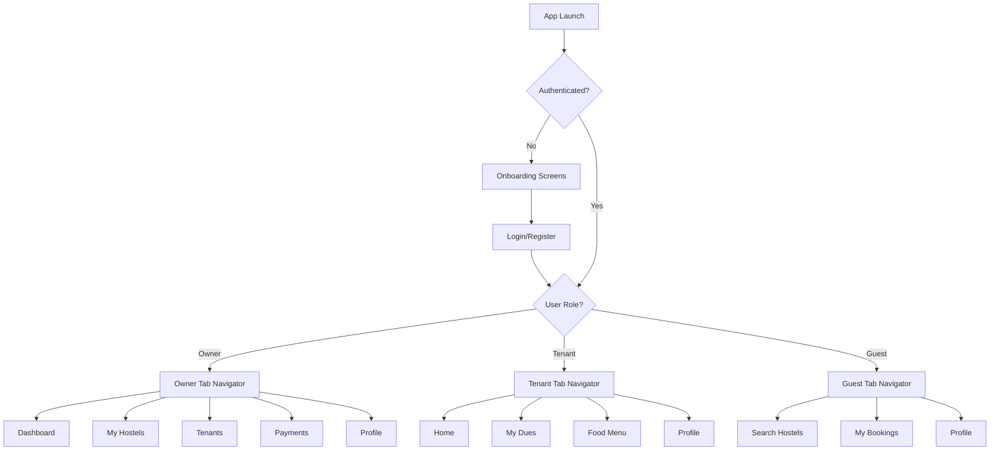

---

## 3. Owner Navigation Flow

### **3.1 Owner Tab Navigator**

```
┌─────────────────────────────────────────┐
│  Bottom Tab Navigation (Owner)          │
├─────────────────────────────────────────┤
│  [Dashboard] [Hostels] [Tenants] [💰] [Profile] │
└─────────────────────────────────────────┘
```

### **3.2 Dashboard Tab**

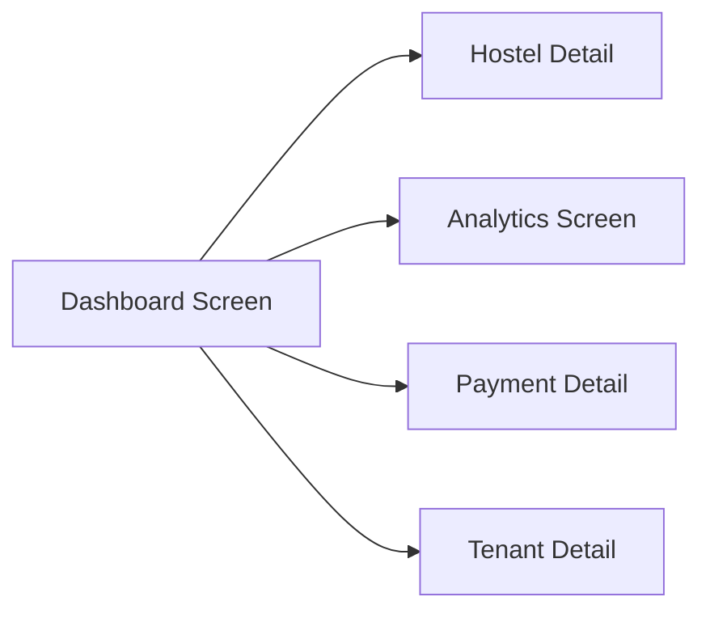

**Dashboard Screen:**
- Summary cards (Total Hostels, Occupancy, Revenue, Pending Dues)
- Recent payments list
- Upcoming dues alerts
- Quick actions (Add Hostel, Add Tenant)

### **3.3 Hostels Tab**

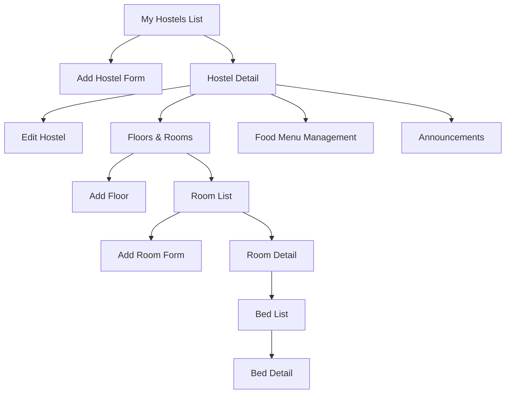

### **3.4 Tenants Tab**

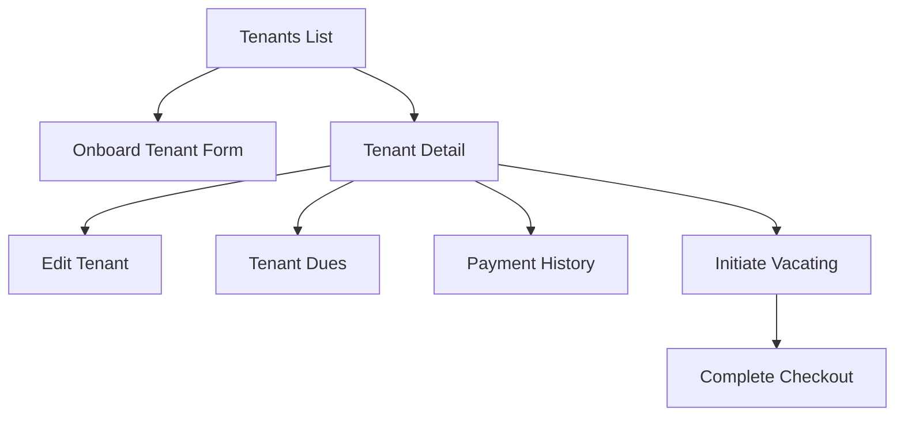

### **3.5 Payments Tab**

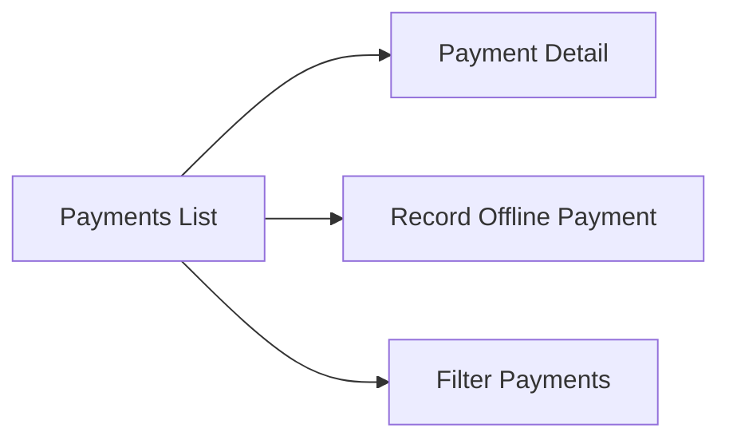

---

## 4. Tenant Navigation Flow

### **4.1 Tenant Tab Navigator**

```
┌─────────────────────────────────────────┐
│  Bottom Tab Navigation (Tenant)         │
├─────────────────────────────────────────┤
│  [Home] [Dues] [Food Menu] [Profile]    │
└─────────────────────────────────────────┘
```

### **4.2 Home Tab**

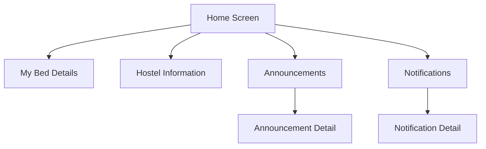

**Home Screen:**
- Welcome message with tenant name
- Bed & room information card
- Hostel details (address, contact)
- Next due date alert
- Recent announcements
- Quick pay button

### **4.3 Dues Tab**

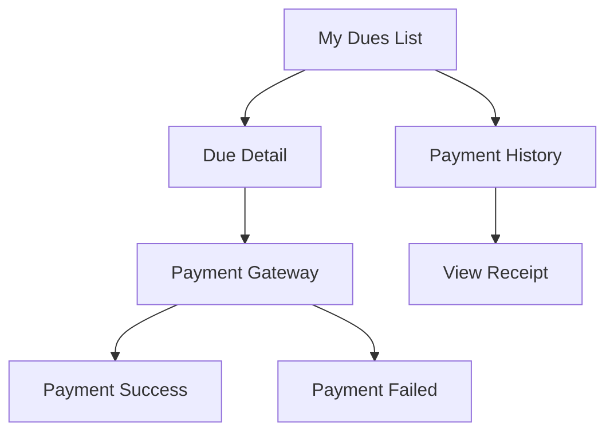

### **4.4 Food Menu Tab**

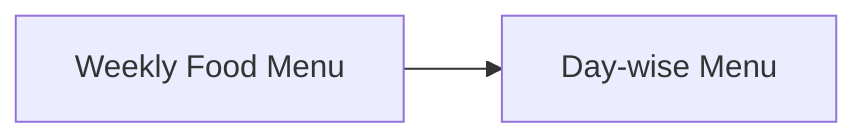

**Food Menu Screen:**
- Weekly calendar view
- Meal cards (Breakfast, Lunch, Dinner)
- Serving times
- Menu items list

---

## 5. Guest Navigation Flow

### **5.1 Guest Tab Navigator**

```
┌─────────────────────────────────────────┐
│  Bottom Tab Navigation (Guest)          │
├─────────────────────────────────────────┤
│  [Search] [Bookings] [Profile]          │
└─────────────────────────────────────────┘
```

### **5.2 Search Tab**

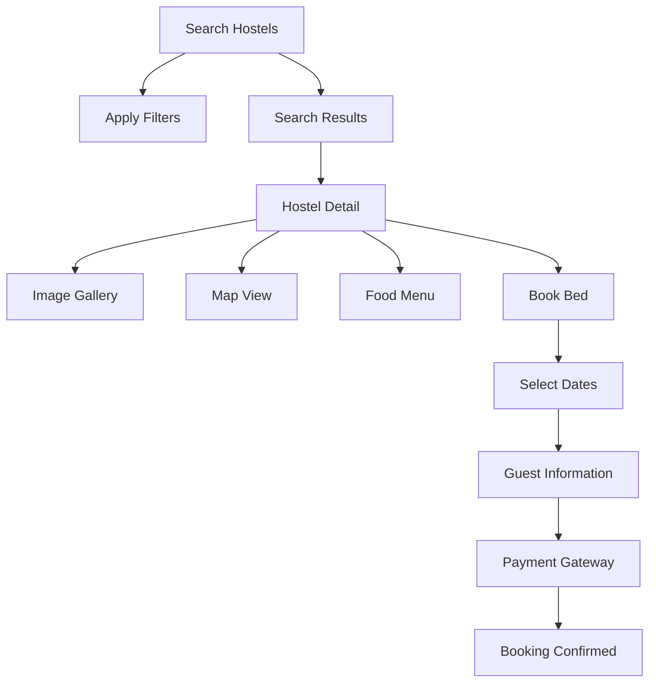

**Search Screen:**
- City search bar
- Date range picker (Check-in/Check-out)
- Filters (Hostel Type, Price Range, Amenities)
- Hostel cards with images, price, rating

### **5.3 Bookings Tab**

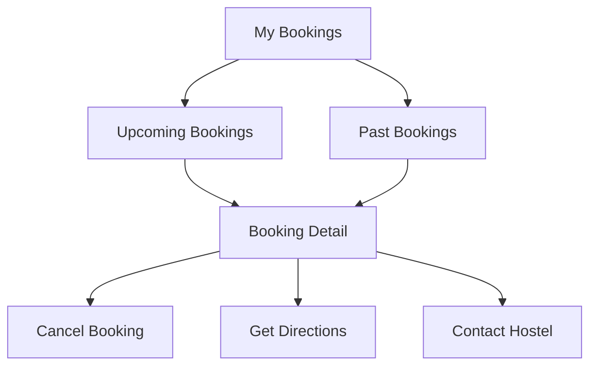

---

## 6. Common Screens (All Roles)

### **6.1 Authentication Flow**

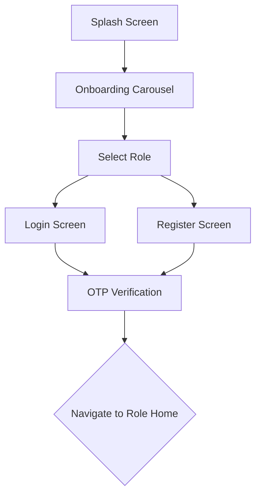

**Onboarding Screens (3 slides):**
1. "Manage Your Hostel Effortlessly"
2. "Track Payments & Tenants"
3. "Find Short Stays Anywhere"

**Login Screen:**
- Email/Phone input
- Password input
- "Forgot Password?" link
- "Don't have an account? Register"

**Register Screen:**
- Full Name
- Email
- Phone
- Password
- Confirm Password
- Role selection (Owner/Tenant/Guest)
- Terms & Conditions checkbox

### **6.2 Profile Tab (All Roles)**

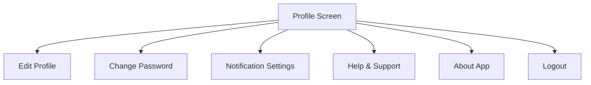

---

## 7. Screen Details by Module

### **7.1 Dashboard Screen (Owner)**

**Components:**
- Header with greeting and notification bell
- Summary cards (4 cards in 2x2 grid)
  - Total Hostels
  - Occupancy Rate
  - Monthly Revenue
  - Pending Dues
- Section: "Recent Payments" (last 5)
- Section: "Upcoming Dues" (next 7 days)
- FAB: "Quick Actions" (Add Hostel, Add Tenant)

**Navigation:**
- Tap summary card → Navigate to respective detail screen
- Tap payment → Payment Detail
- Tap due → Tenant Detail
- Tap notification bell → Notifications List

---

### **7.2 Add Hostel Screen (Owner)**

**Form Fields:**
1. Basic Information
   - Hostel Name *
   - Description
   - Hostel Type * (Radio: Boys/Girls/Co-Ed)
   
2. Location
   - Address Line 1 *
   - Address Line 2
   - City * (Autocomplete)
   - State * (Dropdown)
   - Pincode *
   - Get Current Location (Button)
   
3. Contact
   - Contact Phone *
   - Contact Email
   
4. Amenities (Multi-select chips)
   - WiFi, Laundry, AC, Parking, Security, CCTV, Gym, etc.
   
5. Pricing
   - Monthly Rent Min *
   - Monthly Rent Max *
   - Daily Rate (for guest bookings)
   
6. Settings
   - Food Included (Toggle)
   - Allow Guest Bookings (Toggle)
   
7. Images (Upload up to 10)

**Validation:**
- All * fields required
- Rent Min <= Rent Max
- Valid email format
- Valid phone format
- Pincode: 6 digits

**Actions:**
- Save & Continue → Navigate to Add Floor
- Save & Exit → Navigate to Hostels List

---

### **7.3 Onboard Tenant Screen (Owner)**

**Form Sections:**

1. **Select Bed**
   - Hostel Dropdown *
   - Floor Dropdown *
   - Room Dropdown *
   - Bed Dropdown * (only AVAILABLE beds)

2. **Personal Information**
   - Full Name *
   - Email
   - Phone * (with OTP verification)
   - Photo Upload *

3. **KYC Documents**
   - Aadhaar Number * (12 digits, masked)
   - Aadhaar Image Upload * (Front & Back)

4. **Emergency Contact**
   - Name *
   - Phone *
   - Relation *

5. **Occupancy Details**
   - Joining Date * (Date picker)
   - Notice Period Days (Default: 30)

6. **Financial Details**
   - Monthly Rent * (Pre-filled from bed)
   - Security Deposit *
   - Advance Paid

**Validation:**
- Phone unique check
- Aadhaar unique check
- Bed availability check
- File size limits (Photo: 2MB, Aadhaar: 5MB)
- Joining date >= today

**Actions:**
- Submit → Upload files → Create tenant → Send welcome SMS → Navigate to Tenant Detail

---

### **7.4 Tenant Home Screen (Tenant)**

**Components:**
- Header: "Welcome, [Tenant Name]"
- Bed Information Card
  - Bed Number
  - Room Number
  - Floor
  - Room Type
  - Amenities icons
  
- Hostel Information Card
  - Hostel Name
  - Address
  - Contact Phone (Call button)
  - Contact Email (Email button)
  
- Next Due Alert Card (if pending)
  - Due Date
  - Amount
  - "Pay Now" button
  
- Announcements Section
  - Latest 3 announcements
  - "View All" link
  
- Quick Actions
  - View Food Menu
  - Payment History
  - Raise Complaint (future feature)

---

### **7.5 Payment Screen (Tenant)**

**Due Detail Screen:**
- Due Month & Year
- Due Date
- Breakdown:
  - Rent Amount
  - Food Charges
  - Electricity Charges
  - Other Charges
  - Late Fee (if overdue)
  - **Total Amount**
  
- Payment Status Badge
- Days Overdue (if applicable)

**Actions:**
- "Pay Now" button → Razorpay Gateway
  - Opens Razorpay SDK
  - User completes payment
  - App verifies signature
  - Shows success/failure screen
  - Sends receipt via email

---

### **7.6 Search Hostels Screen (Guest)**

**Search Bar:**
- City input (Autocomplete)
- Date Range Picker (Check-in, Check-out)
- "Search" button

**Filters (Bottom Sheet):**
- Hostel Type (Boys/Girls/Co-Ed)
- Price Range (Slider: ₹0 - ₹2000)
- Amenities (Multi-select)
- Sort By (Price, Rating, Distance)

**Results List:**
- Hostel Card:
  - Image carousel
  - Hostel Name
  - City
  - Daily Rate
  - Rating (stars)
  - Distance from current location
  - Available Beds count
  - Amenities icons (top 4)
  - "View Details" button

**Empty State:**
- "No hostels found in [City]"
- "Try adjusting your filters"

---

### **7.7 Hostel Detail Screen (Guest)**

**Sections:**

1. **Image Gallery**
   - Full-width carousel
   - Tap to open full-screen gallery

2. **Basic Info**
   - Hostel Name
   - Hostel Type badge
   - Rating & Reviews count
   - Address with "Get Directions" button

3. **Pricing**
   - Daily Rate (large, prominent)
   - "Book Now" button

4. **Amenities**
   - Grid of amenity icons with labels

5. **Food Menu**
   - "View Weekly Menu" expandable section

6. **About**
   - Description text

7. **Contact**
   - Phone (Call button)
   - Email (Email button)

8. **Location**
   - Map view with marker

**Actions:**
- "Book Now" → Select Dates Screen

---

### **7.8 Booking Flow (Guest)**

**Step 1: Select Dates**
- Check-in Date Picker
- Check-out Date Picker
- Number of Days (auto-calculated)
- Total Amount (auto-calculated)
- "Continue" button

**Step 2: Guest Information**
- Guest Name * (Pre-filled from profile)
- Guest Phone * (Pre-filled)
- Guest Email
- Special Requests (Optional)
- "Proceed to Payment" button

**Step 3: Payment**
- Booking Summary
  - Hostel Name
  - Dates
  - Number of Days
  - Daily Rate
  - Total Amount
- "Pay ₹[Amount]" button → Razorpay

**Step 4: Confirmation**
- Success animation
- Booking ID
- QR Code (for check-in)
- Hostel contact details
- "View Booking" button
- "Get Directions" button

---

## 8. Navigation Patterns

### **8.1 Stack Navigation**
- Each tab has its own stack navigator
- Allows deep navigation within tabs
- Back button returns to previous screen in stack

### **8.2 Modal Navigation**
- Used for forms (Add Hostel, Add Tenant)
- Full-screen modals with close button
- Prevents accidental navigation away

### **8.3 Bottom Sheets**
- Filters
- Quick actions
- Confirmation dialogs

### **8.4 Deep Linking**
- `/hostel/:hostelId` → Hostel Detail
- `/booking/:bookingId` → Booking Detail
- `/payment/:paymentId` → Payment Receipt
- Push notification → Relevant screen

---

## 9. Screen States

### **9.1 Loading States**
- Skeleton screens for lists
- Shimmer effect for cards
- Spinner for button actions

### **9.2 Empty States**
- Illustration + message
- Call-to-action button
- Examples:
  - "No hostels yet. Add your first hostel!"
  - "No bookings found. Start exploring!"

### **9.3 Error States**
- Error icon + message
- "Retry" button
- Examples:
  - "Failed to load data. Please try again."
  - "Network error. Check your connection."

---

## 10. Offline Support

### **10.1 Cached Data**
- Dashboard summary
- Hostel list
- Tenant list
- Food menu

### **10.2 Offline Indicators**
- Banner at top: "You're offline"
- Disabled actions that require network
- Queue actions for sync when online

---

This completes the screen navigation flow. Next, I'll create detailed module-wise feature breakdowns.
